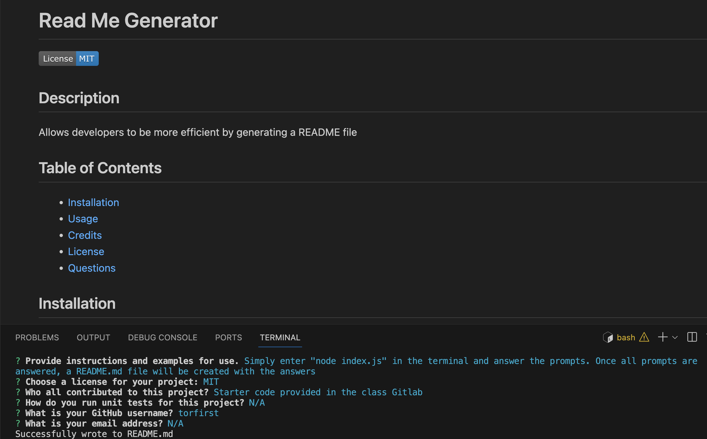

# Read Me Generator

## Description
This project allows developers to save time and be more efficient by providing a README skeleton/template where users can answer prompts and have a README.md file generated automatically. 

## Table of Contents
- [Installation](#installation)
- [Usage](#usage)
- [Credits](#credits)
- [License](#license)

## Installation
Clone the repo and install the inquirer package by typing in "npm install inquirer@8.2.4" in the terminal. Inquirer 8.2.4 is required for this project to work.

## Usage
Users can simply enter "node index.js" in their terminal and answer the prompts. Once all prompts are answered, a README.md file will be created with their answers.

[Click here to watch a video walkthrough.](https://app.screencastify.com/v2/watch/MZyVUiUfROPvU8qKcdoM)

## Credits
Starter code was provided in the class Gitlab. I also used Xpert Learning Assistant as a resource to answer some questions I had.

## License
Refer to repo for license.